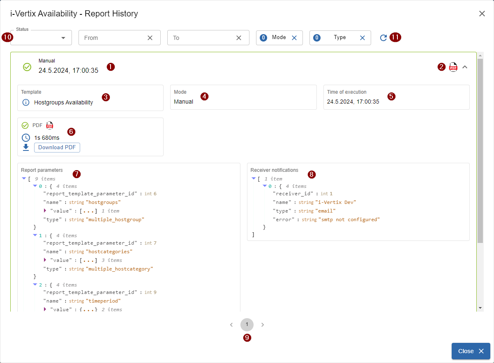
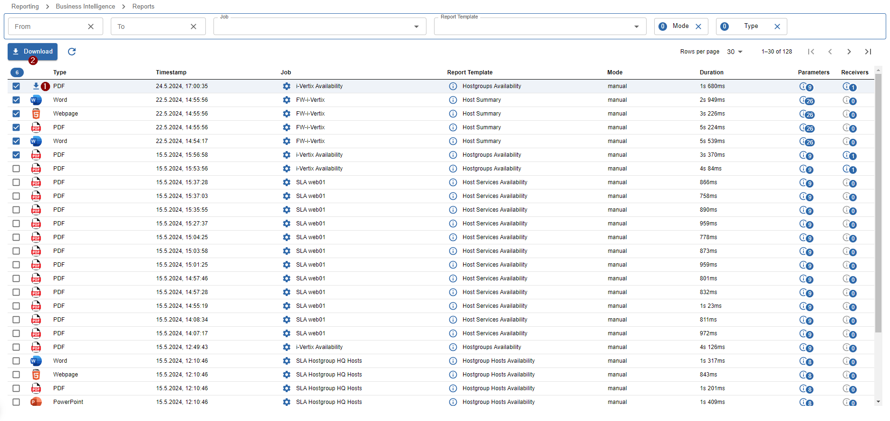
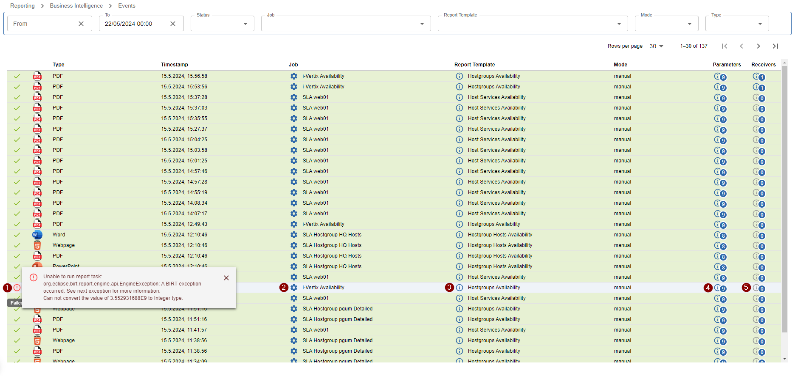

import ImageCounter from "../../../../src/components/ImageCounter";

## Report Job List

### Download the last generated Reports

[Report job list](../../assets/bi/jobs_ready.png)

To directly download the last generated report straight away from the report job list, click on
the <ImageCounter num={1} /> file icon on the right side of the report job row.
While hovering the file icon you can see the creation date of the report file.

## Report Job History

To access the Report Job History, click the <ImageCounter num={2} /> report history icon from the report job list.
A large dialog should open.

Here you will find detailed information about all reports generated by the report job the dialog was opened from.

All list items can be expanded by simply clicking on the list item.

Explanation of displayed information:

- <ImageCounter num={1} /> Details about the execution (scheduling mode and execution timestamp)
- <ImageCounter num={2} /> Directly download reports by clicking on the file icons
- <ImageCounter num={3} /> Used template - clicking the <code>i</code>nfo button opens the report template detail dialog
- <ImageCounter num={4} /> Scheduling mode which was used to generate the report
- <ImageCounter num={5} /> Date and time when the report was executed
- <ImageCounter num={6} /> Duration, eventual errors and the possibility to download single files
- <ImageCounter num={7} /> List of report paramters which where used to generate the report 
- <ImageCounter num={8} /> List of sent notifications and eventual errors
- <ImageCounter num={9} /> Pagination
- <ImageCounter num={10} /> Different filters to find older or failed reports more easier 
- <ImageCounter num={11} /> Refresh

## Report List

We have also created a dedicated view only for generated reports located under `Reporting -> Business Intelligence -> Reports`.

From there you can easily download single report files or multiple report files by:

- clicking the <ImageCounter num={1} disableMargin /> download button while hovering rows
- selcting multiple reports using the checkboxes and clicking the <ImageCounter num={2} disableMargin /> download button on top of the list

## Report Event List

We have also created an Event List which is useful to understand which reports work and which don't.

The above mentioned [Report List](./bi-viewing-reports#report-list) only lists successful reports while the Event List also shows failed reports.

Failed reports are easily recognizable due to their red background.
To view the error message you can click on the <ImageCounter num={1} disableMargin /> error icon in front.

The <ImageCounter num={2} disableMargin /> settings button takes you directly to the configuration of the job which produced the error.

The <ImageCounter num={3} disableMargin /> info button opens the report template detail dialog.

The last two buttons <ImageCounter num={4} disableMargin /> and <ImageCounter num={5} disableMargin /> open the parameter and receiver configuration used to generate the report.
