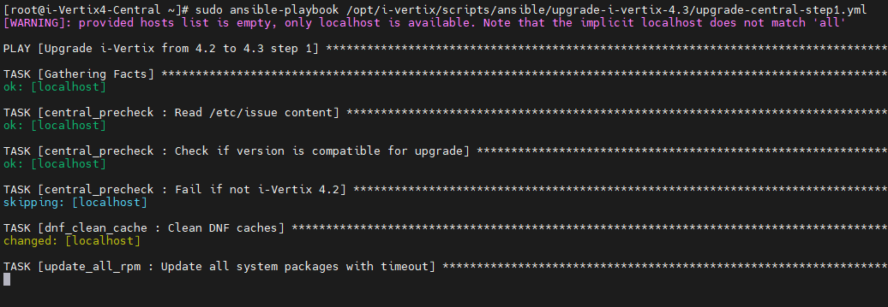
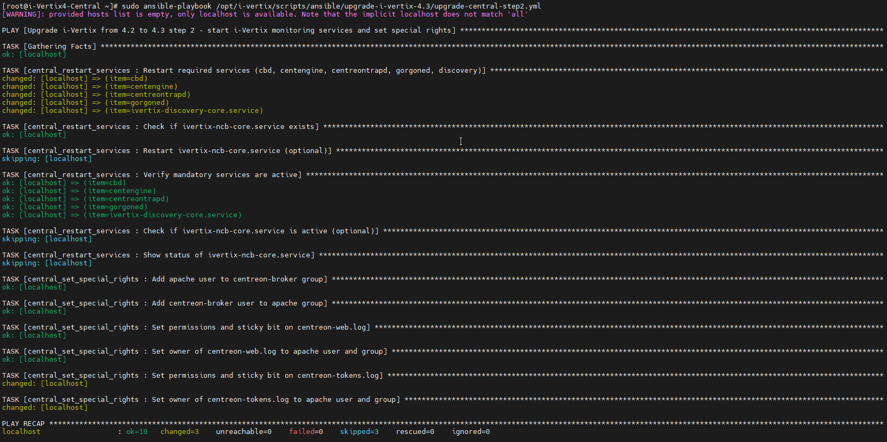
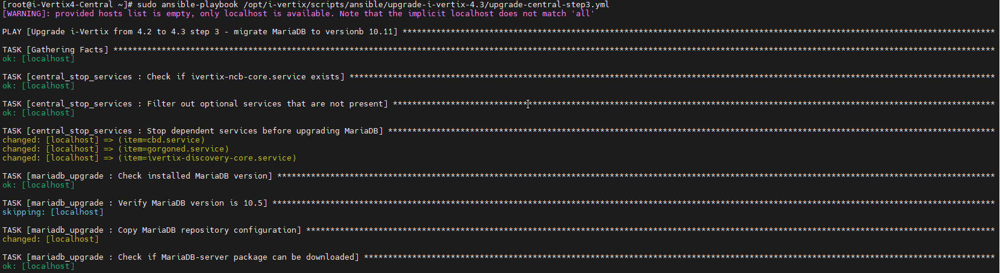

import ImageCounter from "../../../src/components/ImageCounter";
import Breadcrumb from "../../../src/components/Breadcrumb";
import Tabs from '@theme/Tabs';
import TabItem from '@theme/TabItem';


:::info

This guide requires your system to be on version 4.2. If you need to upgrade from an older version, please contact us via support@i-vertix.com.

:::

## Prerequisites

:::warning

Before attempting any upgrade, please make sure to create a snapshot or a backup
of your i-Vertix Central Virtual Machine and any other Machine involved.

To upgrade the systems, a stable internet connection is required on the Central and on each Poller.

:::


## Upgrade Central Server

### Prepare the Upgrade

Start by logging in the system using ssh.
The user needs to be able to run commands with sudo.

Make sure that the version reported in the login banner is `4.2.0`.


Install the automated upgrade scripts with following command:
```bash
sudo dnf install ivertix-ansible-playbooks
```

In the case that some question are asked during the installation, please reply `y` (type y and confirm with Enter).


### Perform Upgrade Step 1

Launch the first step of the Central system upgrade with following command:
```bash
sudo ansible-playbook /opt/i-vertix/scripts/ansible/upgrade-i-vertix-4.3/upgrade-central-step1.yml
```




Since the scripts upgrade the entire system and download many packages, 
the process may take up to 45 minutes or longer, 
depending on the hardware resources and the internet connection of the Central Monitoring server.

After the execution, the report on performed operations (PLAY RECAP) should look like this:


### Perform Application Upgrade

After the first upgrade step is complete you need to perform the application upgrade.

#### Upgrade Wizard

Open the Monitoring Interface in your Browser and step through the displayed upgrade wizard.

:::note

You must be **logged out** to access the wizard.

:::

<details>
<summary>Application Upgrade Wizard</summary>


</details>

#### Update Modules

Then, login with an administrator account and navigate to <Breadcrumb crumbs={["Administration", "Extensions", "Manager"]} />.

{/* Restore if a navigation screenshot is preferable. */}
{/*  */}


- <ImageCounter num={1} /> Click the `Update all` button to update all installed *Modules*
    > The modules are updated simultaneously, it may take some time until every module is updated.
- <ImageCounter num={2} /> Click the `Install all` button to install all available *Modules*

After the updates are complete, every module should turn green (up-to-date).


### Perform Upgrade Step 2

Return to the *Central's* CLI and run the next upgrade script:

```bash
sudo ansible-playbook /opt/i-vertix/scripts/ansible/upgrade-i-vertix-4.3/upgrade-central-step2.yml
```



### Perform Upgrade Step 3

After Step 2 is finished, we need to upgrade the MariaDB database. 

The procedure varies depending on whether the database is embedded (i.e. located on Central server)
or deployed on a remote server.
See [Remote Database Management architecture](../installation/before-you-start/architecture#dbms)
for more details.

<Tabs>
<TabItem value="internal_db" label="Embedded Database" default>

In cases where the database is deployed on the same host as the monitoring application, run:

```bash
sudo ansible-playbook /opt/i-vertix/scripts/ansible/upgrade-i-vertix-4.3/upgrade-central-step3.yml
```



After the execution, the report on performed operations (PLAY RECAP) should look like this:


</TabItem>
<TabItem value="external_db" label="Remote Database">

If the database is located on a remote server, we need to run a different upgrade script.

Please contact us at [support@i-vertix.com](mailto:support@i-vertix.com) for more information.

</TabItem>
</Tabs>

### Finalize Upgrade

Reboot the Central server using following command:

```bash
sudo reboot
```

:::tip

It is strongly suggested to **clean the Browser cache** before logging in again to avoid errors on the web application.

:::

## Upgrade Pollers

### Perform Automatic Upgrade

To upgrade all *Pollers*, we need to run the following command in the *Central server* CLI:

```bash
sudo ansible-playbook /opt/i-vertix/scripts/ansible/upgrade-i-vertix-4.3/upgrade-poller.yml
```

By default, the automated script will upgrade 5 pollers simultaneously until every single configured poller is upgraded.

You can also upgrade a single *Poller* by adding the option `-l <poller name>`:

```bash
sudo ansible-playbook /opt/i-vertix/scripts/ansible/upgrade-i-vertix-4.3/upgrade-poller.yml -l Poller1
```

### Verify Poller Upgrade

To verify that the pollers are working after the upgrade, log in to the monitoring system with an administrator account
and navigate to <Breadcrumb crumbs={["Configuration", "Pollers"]} />.


Check the following properties:

- <ImageCounter num={1} /> is the poller running?
- <ImageCounter num={2} /> is the poller sending data to the central monitoring server?
- <ImageCounter num={3} /> is the poller updated to the new major version (24.10)?

If the poller is not running, check the upgrade log for any errors.
You can also try to [export the monitoring configuration to the poller](../monitoring-resources/export-configuration).
When doing so, make sure to select `Restart` instead of `Reload` for the *Restart Monitoring Engine* option.

:::note

Each *Poller* may take some time to send the collected monitoring data after the system upgrade.

If not every <ImageCounter num={2} /> *Last Update* is up-to-date during your initial check, wait a few minutes and verify again.
By then, all data should be synced.

:::
