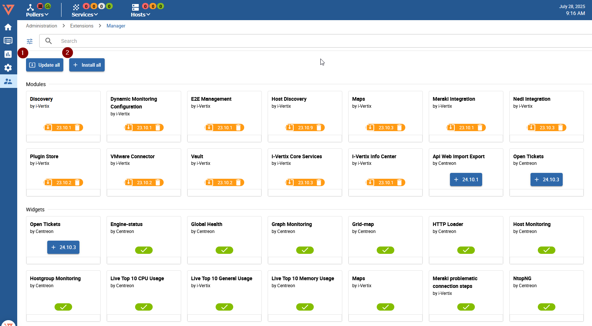

import ImageCounter from "../../../src/components/ImageCounter";
import Breadcrumb from "../../../src/components/Breadcrumb";
import Tabs from '@theme/Tabs';
import TabItem from '@theme/TabItem';


:::info
This guide requires your system to be on version 4.2. If you need to upgrade from an older version, please contact us via support@i-vertix.com.
:::

## Prerequisites

:::warning
Before attempting any upgrade, please make sure to create a snapshot or a backup
of your i-Vertix Central Virtual Machine and any other Machine involved.

To upgrade the systems, a stable internet connection is required on the Central and on each Poller.
:::


## Upgrade Central Server

### Prepare the Upgrade

Start by logging in the system using ssh.
The user needs to be able to run commands with sudo.

Install the automated upgrade scripts with following command:
```
sudo dnf install ivertix-ansible-playbooks
```


### Perform Upgrade Step 1

Launch the first step of the Central system upgrade with following command:
```
sudo ansible-playbook /opt/i-vertix/scripts/ansible/upgrade-central-42-to-43-step1.yaml
```


Since the scripts upgrade the entire system and download many packages, 
the process may take up to 45 minutes or longer, 
depending on the hardware resources and the internet connection of the Central Monitoring server.

### Perform Application Upgrade

After the first system upgrade, it is time for the WebUI.
Open the Monitoring Interface in your Browser and step through the displayed upgrade wizard.

:::note

You must be logged out to access the upgrade wizard

:::


<details>
<summary>Application Upgrade Wizard</summary>


</details>

Then, login in the Central and visit

<!---
TODO: evaluate wheter to replace the screenshot with the provided breadcrumb.
<Breadcrumb crumbs={["Administration", "Extensions", "Manager"]} />
-->


Click the `Update all` button to update.




When all Extensions are updated, the page should become as follows:


### Perform Upgrade Step 2

Return to the cli and run the next upgrade script:

```
sudo ansible-playbook /opt/i-vertix/scripts/ansible/upgrade-central-42-to-43-step2.yaml
```


### Perform Upgrade Step 3

At this point, we need to upgrade the MariaDB database. 
The procedure varies depending on whether the database is embedded (i.e., installed on the same machine as the Central) 
or deployed on a remote server. 
See [Remote Database Management architecture](/monitoring/installation/before-you-start/architecture#dbms)
for more details.

<Tabs>
<TabItem value="internal_db" label="Embedded Database" default>

In cases where the database is deployed on the same host as the web application, run:

```
sudo ansible-playbook /opt/i-vertix/scripts/ansible/upgrade-central-42-to-43-step3.yaml
```

</TabItem>
<TabItem value="external_db" label="Remote Database">

If the system architecture has a separate database, we need to run a different upgrade script.
Please contact us at support@i-vertix.com for more information.

</TabItem>
</Tabs>


### Finalize Upgrade

At last, we need to reboot the Central.

```
sudo reboot
```

:::tip
It is strongly suggested to clean the Browser Cache before 
logging in again to avoid errors on the web application.
:::


## Upgrade Pollers
### Perform Automatic Upgrade

To upgrade all the Pollers, we need to run the following command 
in the Central server CLI:

```
sudo ansible-playbook /opt/i-vertix/scripts/ansible/upgrade-poller-42-to-43.yaml
```

