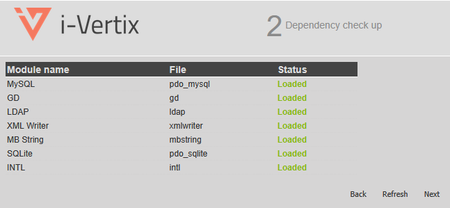

# Prerequisites

:::warning
Before attempting any Update, please make sure to create a snapshot or a backup
of your i-Vertix Central Virtual Machine.
:::

This guide applies to i-Vertix Central version 4.2, please also ensure 
that the Central has Internet access.

## Installing upgrade package

Start by logging in the system using ssh.
The user needs to be able to run commands with sudo.

The first operation is to check whether the upgrade package is already installed or not.

```
sudo dnf list ivertix-ansible-playbooks
```

If the package needs to be installed, it will be shown in the list "Available Packages"


otherwise, it will be shown as an "Installed Packages".


In the case the installation is needed, run

```
sudo dnf install ivertix-ansible-playbooks
```


## Launching first upgrade step

After installing the upgrade package, run

```
sudo ansible-playbook /opt/i-vertix/scripts/ansible/upgrade-central-42-to-43-step1.yaml
```


to really start the upgrade. 
Since the scripts update the entire system and download many packages, 
the process may take up to 45 minutes or longer, depending on the speed of your Internet connection.


## WebUI Login and update

After the first system update, it is time for the WebUI.
Using a browser, visit the Central WebPage and follow the wizard clicking next.





Then, enter the admin credentials and visit the `Administration > Extensions > Manager` page.


Click the `Update all` button to update.


When all Extensions are updated, the page should become as follows:


## Final update steps

Now it's time to get back to the cli and run the next update steps:

```
sudo ansible-playbook /opt/i-vertix/scripts/ansible/upgrade-central-42-to-43-step2.yaml
```


Then:

```
sudo ansible-playbook /opt/i-vertix/scripts/ansible/upgrade-central-42-to-43-step3.yaml
```


and finally reboot the system.

```
sudo reboot
```

## Poller update

After the Central, we need to update the Pollers.
On the Central CLI, run:

```
sudo ansible-playbook /opt/i-vertix/scripts/ansible/upgrade-poller-42-to-43.yaml
```

to update all Pollers connected to the Central.
